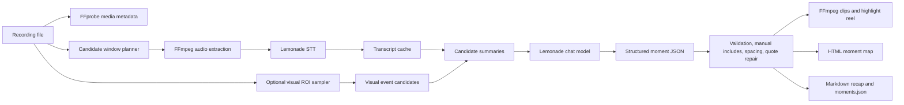

# Architecture

Lemonade Replay Studio is a local replay-analysis pipeline. It uses Lemonade for AI tasks and FFmpeg for deterministic media operations.

## Runtime Boundary

Replay Studio keeps the AI/runtime boundary explicit:

- Lemonade STT transcribes candidate audio windows locally.
- Lemonade chat ranks moments, writes titles, selects quotes, and explains why each moment matters.
- FFmpeg probes media, extracts audio, cuts clips, applies fades, overlays source timestamp ranges, and builds the combined MP4 reel.
- Local Python code handles candidate planning, caching, schema validation, visual-signal detection, and report generation.
- Manual `--include-range` clips are guaranteed outputs and can suppress nearby AI picks to avoid duplicate clutter.

This split matters because it keeps the project portable. The media layer works on macOS, Windows, and Linux, while Lemonade provides the local AI contract.

## Candidate Generation

The default gameplay path uses context windows rather than pure loudness. A run can also add cheap local signals:

- audio energy spikes
- fixed-stride context windows
- named visual regions such as `hp_bar`

For visual events, Replay Studio samples a named region of interest, measures visual change over time, and turns spikes into candidate timestamps. The current implementation is multimodal input, not a vision-language model: screen-derived events are merged with transcript candidates before the Lemonade LLM ranks the final moments.

## Lemonade Ranking

The ranking prompt receives compact candidate summaries, transcripts, the user goal, and any visual metadata. It asks the local model for strict JSON containing:

- title
- score
- reason
- quote
- recommended source range
- candidate evidence

Local models can return imperfect JSON, so Replay Studio validates the response, repairs recoverable mismatches, and falls back conservatively when needed.

## Export Artifacts

Each analysis run writes:

- `moment_map.html`
- `highlight_reel.mp4`
- `clips/*.mp4`
- `moments.json`
- `recap.md`
- optional visual event evidence under `visual/`

The HTML report is intentionally self-contained enough to inspect the selected moments and reasoning. The MP4 files are generated locally because they can be large and depend on the user's source recording.

## Extension Points

The main extension points are:

- add visual signal presets in `visual.py`
- improve prompt/ranking behavior in `prompts.py`
- add provider behavior in `providers.py`
- tune clip spacing and selection in `analyzer.py`
- add new report fields in `report.py`

Future Lemonade vision-model support can replace or augment manual ROI presets by letting a model identify game HUD elements from a representative frame.
